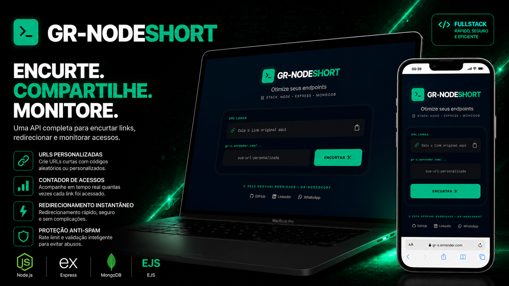

<div align="right">
  <a href="./README.pt.md">🇧🇷 Português</a>
</div>

<div align="center">

# 🔗 GR-NodeShort

<p align="center">
  
  
  
  
  
  
  
</p>

A fullstack web interface and API for shortening links, redirecting users, and monitoring access. A fullstack project focused on simplicity, modern design, and performance.

👉 **Live demo:** [https://ns.grdev.app.br](https://ns.grdev.app.br)

</div>

---

## 🖥️ Preview

<p align="center">
  
</p>

---

## ⚡ Features

| Feature | Description |
|---|---|
| 🔗 **URL Shortening** | Generates random codes or accepts custom slugs |
| ↪️ **Redirection** | Instantly forwards users to the original link |
| 📊 **Click Counter** | Tracks how many times each link has been accessed |
| 🎨 **Modern UI** | Responsive interface with Glassmorphism effect (EJS + CSS) |
| 🛡️ **Security** | URL validation and special character blocking via Regex |
| 📋 **Quick Copy** | Copies the generated link to clipboard with visual feedback |
| 🚦 **Rate Limiting** | Protection against spam and API abuse |

---

## 🛠 Tech Stack

| Layer | Technology | Purpose |
|---|---|---|
| **Backend** | `Node.js + Express` | Server and routing |
| **Frontend** | `EJS` | View engine / templates |
| **Database** | `MongoDB + Mongoose` | Data persistence |
| **Validation** | `Zod` | Schema and input validation |
| **Security** | `Express Rate Limit` | Spam and abuse protection |
| **Infra** | `Docker + Docker Compose` | Application containerization |
| **CI/CD** | `GitHub Actions` | Automated build and deploy pipeline |

---

## 🗂️ Project Structure

```text
NODEShort/
├── .github/
│   └── workflows/
│       └── deploy.yml            # GitHub Actions CI/CD pipeline
├── public/                       # Static assets (CSS, images, JS)
├── views/
│   └── index.ejs                 # Main EJS template
├── src/
│   ├── controllers/              # Route handler logic
│   ├── middleware/               # Rate limiting and request guards
│   ├── models/                   # Mongoose schema definitions
│   ├── routes/                   # Express route declarations
│   └── server.js                 # Application entry point
├── .env.example                  # Environment variable reference template
├── docker-compose.yml            # Multi-container orchestration config
├── Dockerfile                    # Production image build instructions
└── package.json
```

---

## 🧠 How Custom URLs Work

The system accepts an optional `customUrl` parameter:

- **Without custom URL** — the server generates a unique random ID (e.g. `abc123`)
- **With custom URL** — checks availability in the database; if free, the link adopts that slug
- **Auto-cleanup** — the backend strips whitespace and the HTML layer validates the format to ensure compatibility

---

## 🗃️ Database Schema

```javascript
{
  originalUrl: String, // Destination link (long URL)
  shortId: String,     // Random code or custom slug
  clicks: Number,      // Access counter (default: 0)
  createdAt: Date      // Auto-generated creation timestamp
}
```

---

## ⚙️ CI/CD Pipeline

The project uses **GitHub Actions** to automate build and deploy on every push to `master`.

```
Push to master
    │
    ▼
Build Docker image
    │
    ▼
Push to Docker Hub
    │
    ▼
SSH into VPS → pull new image → recreate container
```

### Required repository secrets

| Secret | Description |
|---|---|
| `DOCKERHUB_USERNAME` | Docker Hub username |
| `DOCKERHUB_TOKEN` | Docker Hub access token |
| `SSH_HOST` | VPS public IP |
| `SSH_USER` | SSH user |
| `SSH_KEY` | Full private SSH key |

Add them under **Settings → Secrets and variables → Actions**.

---

## 🚀 Running Locally

### Initial setup

```bash
git clone https://github.com/Geovanni-dev/gr-nodeshort
cd encurtador-url
```

Edit `.env.example` and fill in your MongoDB `DATABASE_URL`.

### Option 1 — Docker 🐳

```bash
docker compose up -d --build
```

### Option 2 — Node.js

```bash
npm install
npm start
```

---

## 🌐 Deployment

Hosted on a **Linux VPS** with fully automated deploys via **GitHub Actions**. Every push to `master` rebuilds the image, pushes it to Docker Hub, and updates the running container on the server with zero manual steps.

- ✅ Containerized infrastructure with **Docker**
- ✅ CI/CD pipeline with **GitHub Actions**
- ✅ Custom domain and subdomain (`ns.grdev.app.br`)

---

## 📄 License

**MIT © Geovani Rodrigues**
